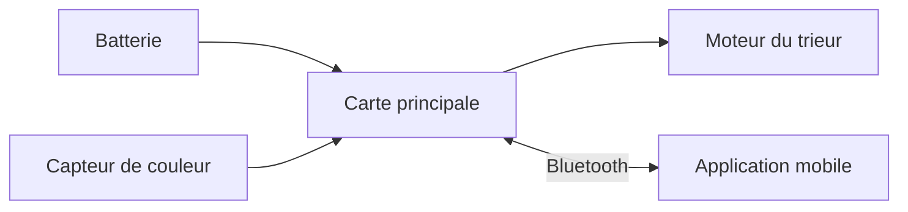

# Conception

{: .a_supprimer }
> **Une page par sous-système, pas une seule page pour toute la conception.**
> Ce template propose un découpage par domaine (mécanique, électronique,
> firmware, software) avec un exemple de sous-système dans les deux premiers. Adaptez-le à votre projet :
> - dupliquez une page d'exemple pour chaque sous-système (pince, châssis, carte capteurs…) ;
> - renommez ou supprimez les domaines qui ne vous concernent pas ;
> - si votre projet s'y prête mieux, découpez d'abord par sous-système, puis par domaine.
>
> Une sous-page se déclare avec `parent:` (et `grand_parent:` au niveau en dessous)
> dans son en-tête : inspirez-vous des pages d'exemple.

## Architecture globale

{: .a_modifier }
> Présentez le projet découpé en sous-systèmes : un schéma bloc (image) et une phrase
> par bloc suffisent. Qui communique avec qui ? Qu'est-ce qui alimente quoi ?
> Exemple : le schéma ci-dessous est écrit en texte avec [Mermaid](https://mermaid.js.org/) :
> modifiez-le directement dans le fichier, ou remplacez-le par une image réalisée
> avec l'outil de votre choix (draw.io, Inkscape, papier scanné…).

