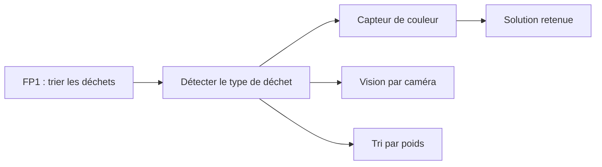

# Études et choix techniques

{: .a_supprimer }
> Le cahier des charges dit *quoi* faire, cette page explique *comment* et **pourquoi** :
> d'abord ce qui existe déjà, puis les tests rapides, puis les choix retenus.
> Si vous avez beaucoup de choix à documenter, faites une sous-page par choix
> (ajoutez `has_children: true` ici et `parent: Études et choix techniques` dans les sous-pages).

## Recherche de l'existant

{: .a_modifier }
> Projets du MakerSpace des années précédentes, projets en ligne (Hackaday,
> Instructables, GitHub…), produits du commerce : qu'est-ce qui fait déjà quelque
> chose de proche, et qu'est-ce que vous en retenez ? Citez vos sources.
> Voir [Rechercher l'existant et étudier la faisabilité](https://doc.makerspace-amiens.fr/workshops/methodologie-de-projet/concepts/rechercher-existant-faisabilite/).

| Solution étudiée | Source | Avantages | Inconvénients | Ce qu'on retient |
|---|---|---|---|---|
| Capteur de couleur TCS3200 | Projet Hackaday similaire | Simple, bien documenté | Sensible à la luminosité ambiante | À tester sous l'éclairage réel |
| Tri par poids (balance) | Produit du commerce | Fiable, peu de composants | Ne distingue pas verre et plastique de même poids | Écarté : ne répond pas au besoin |
| Vision par caméra | Forum robotique | Précis, flexible | Complexe à mettre en œuvre dans le délai | Écarté pour ce projet, piste pour une v2 |

## Pré-étude de faisabilité

{: .a_modifier }
> Quels points techniques vous inquiétaient, et comment les avez-vous testés
> rapidement (montage sur platine d'essai, pièce imprimée de test…) ? Résultats ?
> Vous pouvez résumer ici et détailler les protocoles et mesures dans la page
> [Tests et résultats](tests.md), avec un lien vers la section concernée.

Exemple : test du capteur de couleur sous l'éclairage réel sur 30 déchets :
27 correctement identifiés.

## Choix techniques

{: .a_modifier }
> Pour chaque choix difficile à remettre en cause (composant central, architecture,
> procédé de fabrication), répondez aux quatre questions ci-dessous. Appuyez-vous
> sur des arguments **techniques** : résultats de tests, performances, contraintes
> du cahier des charges.
> Voir [Tracer ses choix techniques](https://doc.makerspace-amiens.fr/workshops/methodologie-de-projet/concepts/tracer-choix-techniques/).

Un diagramme **FAST** aide à passer d'une fonction du cahier des charges aux
solutions possibles :

### Choix : titre du choix

**Contexte :** …

**Options envisagées :** …

**Choix retenu et pourquoi :** …

**Compromis acceptés :** …
